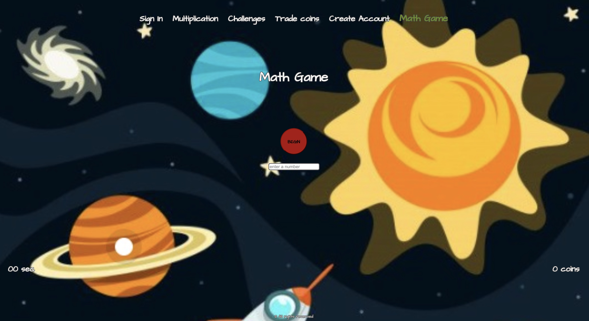

# Math Game 
This is a Capstone project for Ada Developers Academy. The purpose of the game is to get kids to practice multiplication while having fun, so they will be more likely to want to practice again.

. 

## Feature Set
The app achieves this in different ways: 

### Recording best time
A user can play and it will continually save the smaller set of time to the session. A user with an account can save their time in the DB and it will be displayed upon log in. 

### Customizing backgrounds
When a user plays they get 10 coins per correct answer the coins get stored in the session. Which they can then trade for different backgrounds. A user with an account can save their background in the DB and it will be displayed upon log in.

### Sending challenges
A user with an account can send and receive challenges. The game will then inform the opponent upon log in that they have been challenged and 


## How to run it:
Clone this repo 
Install dependencies with 
```
npm install
```
You can start a development server by running
```
npm start
```

## If you want to build a Docker container:

```
npm run build
docker build .
```
Docker container is based on bitnamis nginx. This provides a fast and light weight way to host the react app.
